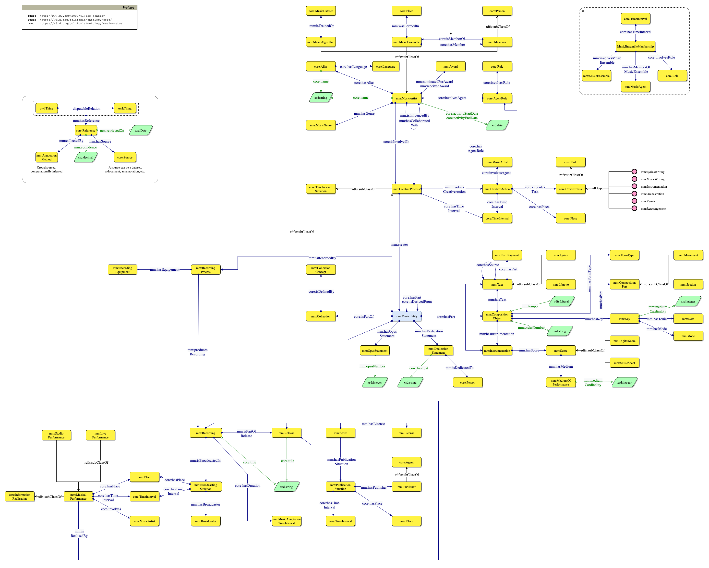

# Introduction

A music analyst, a computational musicologist, a music librarian, and a data engineer are working on a joint project.
They need to contribute data from various musical sources, ranging from music libraries, annotated corpora and tune books, to audiovisual archives, radio broadcasts, and music catalogues.
All data is eventually merged/aggregated as interconnected corpora, and linked to online music databases (e.g. MusicBrainz, Discogs) and knowledge bases (e.g. Wikidata).
This creates opportunities to link cultural heritage artefacts to music industry data (streaming services, music professionals, etc.) and viceversa.

This plot subsumes a recurring challenge for musical heritage projects like Polifonia.
Besides the individual requirements of each stakeholder - possibly rooted in different music genres, periods and datasets, a fundamental requirement is the **interoperability** of music metadata.

## What is so special with metadata?
Music metadata (alias bibliographic, or documentary music data) is used to consistently identify and describe musical works, their artists, recordings, and performances.
For music industry, it allows for efficient management and distribution of music, which facilitate search and recommendation.
When metadata is accurate, it ensures that artists receive proper credit and compensation.
For musical heritage, metadata allows for the preservation and dissemination of musical works and traditions, but also aid in the research and study of music history and culture .
When integrating both views, metadata can help to promote diversity and inclusivity in the music industry by highlighting lesser-known genres and artists, while integrating information and artefacts of cultural interest.

## Why another music ontology?

*What about reusing existing ontologies, like the Music Ontology (MO) and the DOREMUS ontology?*
Modelling music metadata across different genres and historical periods, to accommodate various use cases over heterogeneous data sources poses a number of challenges.
First of all, it requires a perspective that harmonises all requirements from different stakeholders - to design a model that can be tailored to different data sources rather than to a single type of dataset.

- **Challenge 1: Domain specificity hampers interoperability**. MO leans towards modelling discographic data with a focus on contemporary music, whereas DOREMUS is inherently rooted in classical music. Nevertheless, when drifting from discographic data and classical music, or attempting to reuse both models, addressing e.g. cultural heritage requirements while fostering interoperability becomes difficult.
- **Challenge 2: Expressivity is needed at different levels**. Another requirement for interoperability and reuse across various data sources is providing expressivity at different degrees, i.e. the possibility to conveniently describe music metadata at the right level of detail. One data source may have granular/detailed information that requires high semantic expressivity (a composition process spread over different time, places, and involving more artists); whereas others may have basic or incomplete data (only the name of an artist is known).
- **Challenge 3: Provenance is fundamental for data integration**. Accounting for provenance is a central requirement for both cultural heritage and music industry. This becomes fundamental when integrating Knowledge Graphs from different datasets and stakeholders - as every single bit of data (each triple) should be attributable to a dataset/KG. Provenance is also needed within the context of a single dataset, at least for claims and links.

> For more info, please check out our GitHub repository and the upcoming manuscript.

