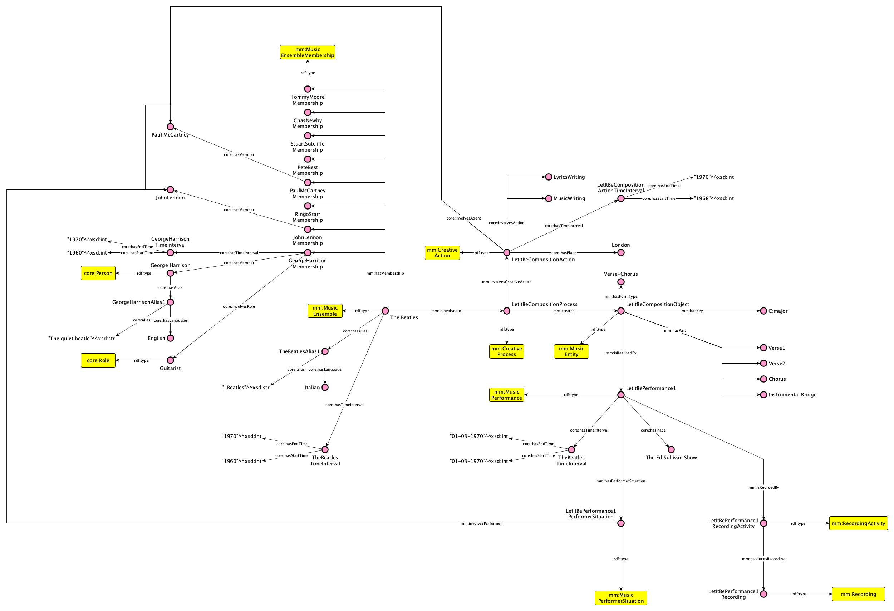

# Congratulations!

You have just learned the **basics of the Music Meta Ontology**. Here is a full example of *Let it be* to wrap up.

Our ecosystem has **much more to offer**! Check out the tutorial on the `pyMusicMeta` in the next section and start creating Music Knowledge Graphs with Music Meta.

Anything **unclear** or **buggy** in this tutorial? [Please report it!](www.github.com)

## What's next?

- Learn how to use [`pyMusicMeta`](/docs/category/tutorial---extras) 
