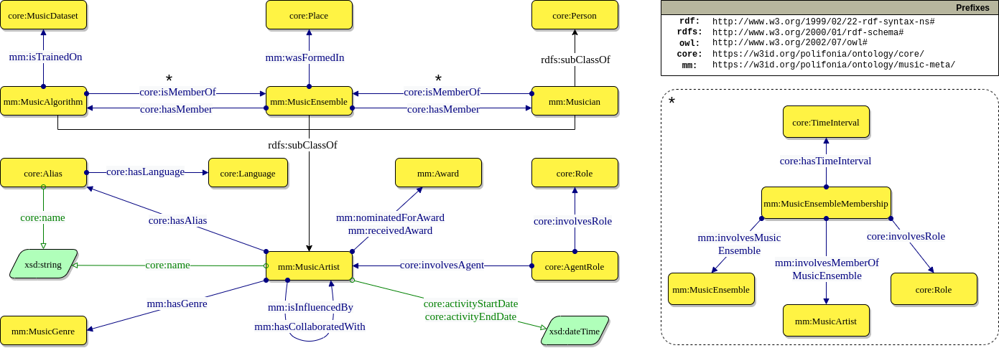

# Create an Artist

To represent music creatives the class `mm:MusicArtist` generalises over musicians (`mm:Musician`), ensembles (`mm:MusicEnsemble`), and computational methods (`mm:MusicAlgorithm`), as illustrated in the diagram below.
Musicians are seen as a specialisation of persons who can optionally be associated to a medium of performance (e.g. voice, guitar), and be part of a music ensemble (e.g. `MusicGroup`, `Orchestra`, `Choir`).
Depending on the data available, the latter can be expressed either through a membership relationship (`core:isMemberOf`), a specialisation of the former, such as `mm:isSingerOf`, or through a `mm:MusicEnsembleMembership` when the period of participation of the musician is available.

All music artists can be associated to (one or more) `mm:MusicGenre`(s), express influences or collaborations, and share a period of activity.
Here, the start date refers to the foundation for music ensembles, whereas the end date is used for discontinued projects for algorithms.

