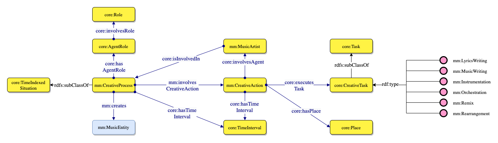
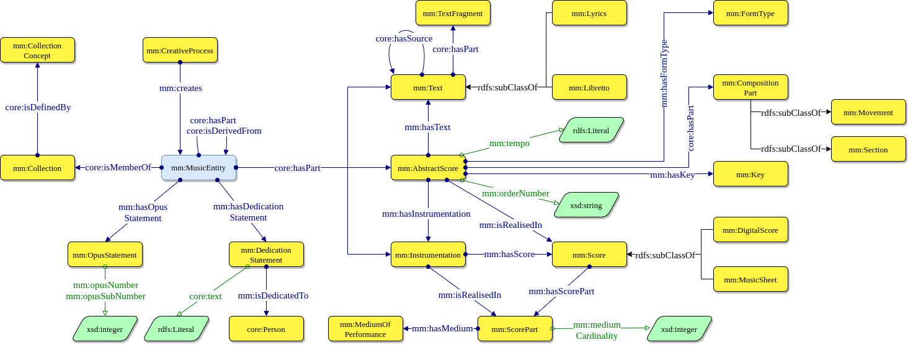

# Create a Music Entity

The focal point of Music Meta is the `mm:MusicEntity` class (figure below). 
This class represents an Information Object, which is defined as the sum of all the elements that make up a piece of music.
A Music Entity is composed of several components, including lyrics (generalised through `mm:Text` to also account for `mm:Libretto`), the musical composition (`mm:CompositionObject`) and its instrumentation (`mm:Instrumentation`).

A `mm:CompositionObject` describes the form of the composition (`mm:FormType`), its constituents parts (e.g. `mm:Movement` or `mm:Section`), and its key (`mm:Key`).
In addition, its datatype properties describe the tempo of the composition (`mm:tempo`) and its order (`mm:orderNumber`).
A `mm:Instrumentation` can instead be formalised in a `mm:Score`, which can be either digital or paper.
Through the score, the instrumentation describes one or more `mm:MediumOfPerformance`, each of which has a cardinality (e.g. 3 violins).

## Relationships and grouping
It is also possible to describe relationships between different Music Entities, defined by the part (`mm:hasPart`) and the derivation (`mm:isDerivedFrom`) properties.
Derivations are used at the user's discretion, based on the dominance of concept [2] (which criteria attribute proper identity to a musical entity) and can be of different types: revision, transposition, cover, reconstruction, reduction, etc.
This makes it possible to describe different types of compositions, rearrangements and modifications of an original piece, as well as influences and more complex types of derivations.
For example, the production of a cover song (e.g. in a different musical genre) may keep the lyrics and introduce a new composition and instrumentation, hence resulting in a new `mm:MusicEntity`.
In addition, Music Entities can be organised in `mm:Collection`, according to a `mm:CollectionConcept` that binds them together.

In sum, the model provides flexibility across periods and genres as the proposed classes allow generalisations to be made about the text, the musical composition and its arrangement.
Through the specialisation of classes, depending on the target domain/application, specificity can easily be achieved.
For example, a tune family can be seen as a `mm:Collection` encompassing several tunes (as music entities) based on specific criteria (e.g. similarity, provenance).

[2] DOREMUS