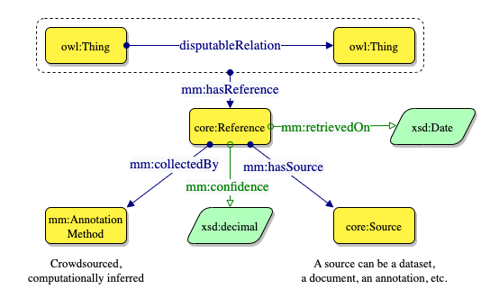

# Links and provenance

We propose a pattern based on `RDF*` [4] to describe the provenance at different levels (figure below).
The use of RDF* is particularly useful for this purpose, as it allows to embed provenance information to every triple in the dataset.
This simplifies and streamlines the model, eliminating the need for n-ary relations or reification for each triple.

The proposed pattern is straightforward and comprises the class `core:Reference`, which describes the source of the reference (using the class `core:Source`) and the method used to obtain the annotation (using the class `core:SourceMethod`).
Additionally, the datatype properties `core:confidence` and `core:retrievedOn` describe the confidence of the annotation and the date it was produced, respectively.

[4] TODO