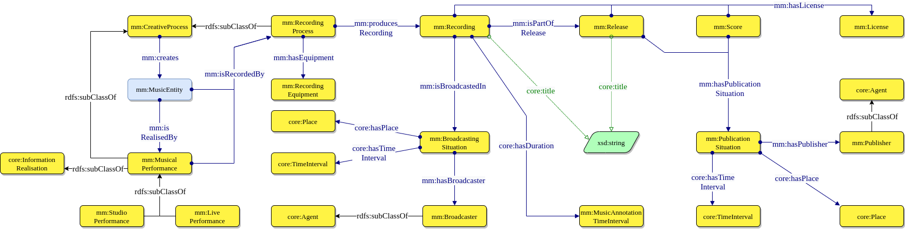

# Create a Performance

The realisation of a `mm:MusicEntity` is exemplified by `mm:MusicalPerformance`, describing a performance that can be either live (`mm:LivePerformance`) or in a studio (`mm:StudioPerformance`).
As illustrated in the figure below, the place and time interval of a performance are described by `core:Place` and `core:TimeInterval` -- involving one or more `mm:MusicArtist`s (optionally with a specific role).
In turn, a performance may create a new `mm:MusicEntity` if the execution differs significantly from the original version.

A Music Entity can also be recorded by means of a `mm:RecordingProcess`, which is a subclass of `mm:CreativeProcess` that allows for specifying location, time interval and persons involved in recording the song. 
This makes it possible to describe information about both the production (e.g., producers) and the technical aspects of it (e.g., sound engineer, equipment used).
The recording process produces a `mm:Recording`, which is contained in a `mm:Release`.

Information about the broadcasting of a recording is modelled through the `mm:BroadcastingSituation` class (an instance of the Situation ODP [3], which describes when and where the song was broadcast, and by which broadcaster (`mm:Broadcaster`).

## Publication and licensing
The `mm:PublicationSituation` class describes information about the publication of a release, which is common to the publication of a `mm:Score` (see figure above). 
For both a release and a score, it describes when and where they were published, and by a `mm:Publisher`.

Licence information is described by the `mm:License` class, which applies to records, releases and scores.